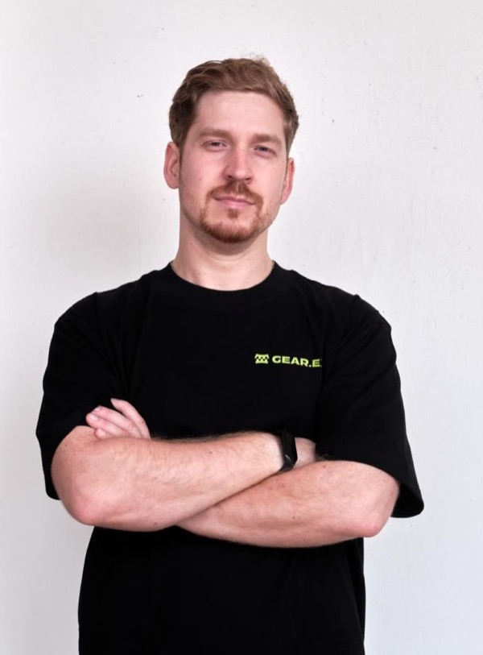

# Соболь Григорий

{width=110pt}

**Старший инженер-программист**
Системы · Компиляторы · Распределённые рантаймы

- **Email:** grishasobolo@gmail.com *(предпочтительный способ связи)*
- **GitHub:** https://github.com/grishasobol
- **LinkedIn:** https://www.linkedin.com/in/gsobol/
- **Локация:** Белград, Сербия
- **Открыт к:** удалённой работе и релокации в EU / UK / US

---

## Кратко

Старший инженер-программист и тимлид с опытом 10+ лет в высокопроизводительных системах — компиляторы, бинарная трансляция, JIT/WASM-рантаймы, распределённый консенсус и прикладная криптография, в основном на Rust и C++. Сейчас веду Vara.eth в Gear Technologies — копроцессор для Ethereum, который проектирую от слоя консенсуса до WASM-рантайма. Ищу роли в вычислительной инфраструктуре под ИИ: рантаймы, компиляторы и перформанс-инжиниринг для прожорливых к ресурсам нагрузок.

---

## Опыт работы

### Старший инженер-программист — Gear Technologies
**Сентябрь 2021 — настоящее время**
Удалённо (gear-tech.io) · L1-протокол / распределённые системы

- **Тимлид Vara.eth** с января 2026 — отвечаю за архитектуру целиком: копроцессор для Ethereum с быстрым BFT-консенсусом на Malachite, протоколом Gear для исполнения программ и управлением через смарт-контракты Ethereum.
- Core-разработчик L1 **Vara Network** (рантайм в стиле Substrate) на Rust.
- Дорабатывал внутренности песочницы и JIT-рантайма WebAssembly — Wasmer, Wasmi, dlmalloc.
- Реализовал критичную для протокола криптографию — secp256k1, пороговые подписи FROST, DLEQ-доказательства.
- Веду решения от дизайна до влитого production-кода и ревью.
- **Примеры работ:**
  - Порт dlmalloc для WASM-программ Gear — https://github.com/gear-tech/dlmalloc-rust
  - BFT-консенсус Malachite для Vara.eth — https://github.com/gear-tech/gear/pull/5419
  - Ленивые обращения к памяти — https://github.com/gear-tech/gear/pull/639

### Ведущий инженер-программист — Huawei Technologies
**Август 2019 — сентябрь 2021**
Москва · Телекоммуникации / мобильная связь

- Разработал оптимизации для универсального бинарного транслятора на базе Linux, ускорив целевой код до ~50% на ключевых нагрузках.
- Повысил стабильность транслятора и создал инструменты нагрузочного тестирования его окружений.

### Инженер-программист — NVIDIA (российское подразделение)
**Август 2018 — август 2019** · Москва

Спроектировал и реализовал новую фазу компиляции в production-бинарном трансляторе, расширив возможности оптимизации целевого кода.

### Старший / младший инженер-программист — Московский физико-технический институт
**Сентябрь 2016 — июль 2018** · Лаборатория сложных организационно-технологических систем (СЛОТС)

Разработал back-end компилятор на основе LLVM и симулятор для цифрового сигнального процессора (C++), а также инфраструктуру тестирования и систему сборки (Python 2/3, Bash, CMake).

### Стажёр-программист — Intel Corporation
**Август 2015 — август 2016** · Москва

Разработка в команде компилятора (поддержка Intel Compiler, C++); автоматизация системного администрирования (Bash, Python).

---

## Навыки

**Языки** · Rust · C/C++ · Python · Bash · ассемблер x86-64 / ARM

**Компиляторы и рантаймы** · LLVM · бинарная трансляция · WASM · JIT / рантайм-внутренности · GDB

**Системы и инструменты** · Linux · ARM · CMake · Git · анализ производительности

**Распределённые системы и криптография** · BFT-консенсус · Ethereum · Solidity · secp256k1 / FROST / DLEQ · ZK

---

## Образование

**Московский физико-технический институт (МФТИ)**

- Магистратура, прикладные математика и физика — 2019
- Бакалавриат, прикладные математика и физика — 2016

---

## Языки

- Русский — родной
- Английский — C1, Advanced

---

## Обо мне

Куда хочу двигаться дальше: вычислительная инфраструктура под ИИ. Меня интересует не создание самих моделей, а системы, на которых они работают — делать прожорливые к ресурсам нагрузки быстрее и эффективнее за счёт перформанс-инжиниринга, рантаймов и компиляторов.

Вне работы: фортепиано, спорт, путешествия. Водительские права категории B.
